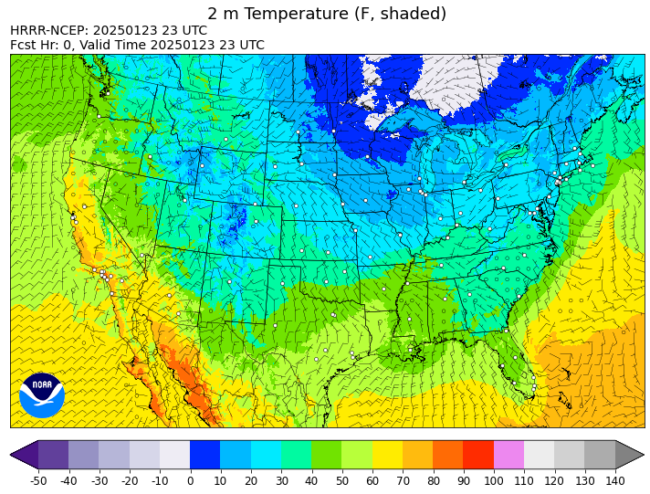
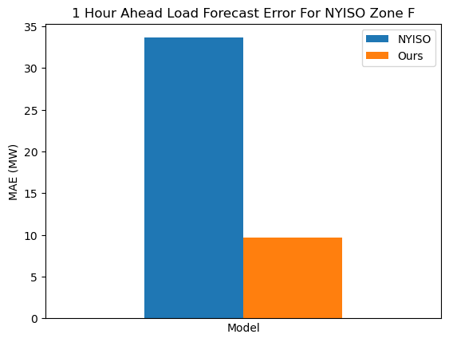
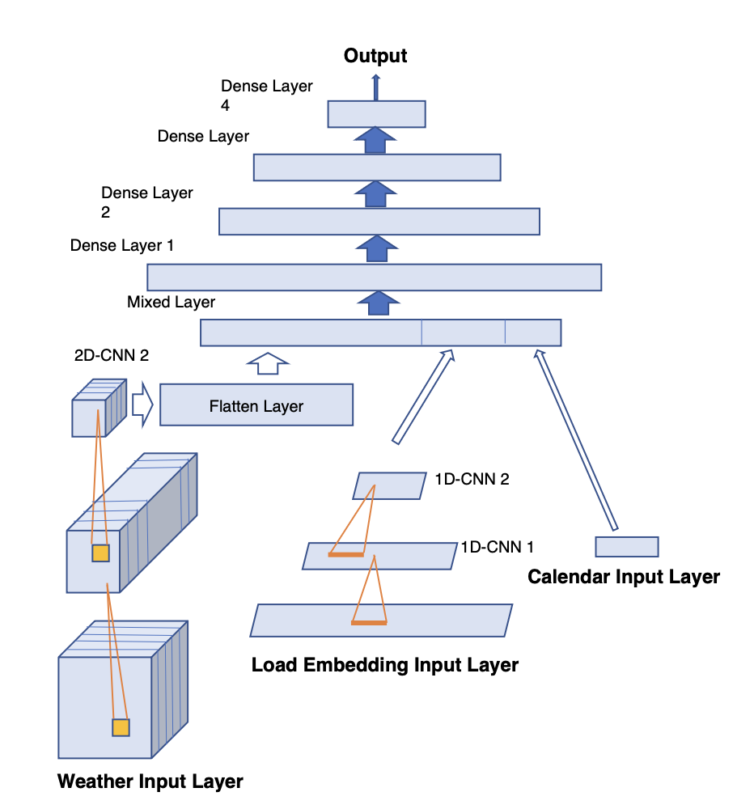

 \
 \

--------------------------------------------------------------------------------
# An Exploration of HHHR Data for Short Term Electric Load Forecast

This is a research project to explore how [HRRR](https://rapidrefresh.noaa.gov/hrrr/) weather data can improve the short term electric load forecast. We use [NYISO](https://www.nyiso.com/real-time-dashboard) load data at Zone F to compare our model based on HRRR data, and NYISO model performance.

The HRRR data provide 3 km spatial resolution, and are supposed to provide more spatial information to improve forecast accuracies. Here is an example of HRRR temperature data at 2m. 

The findings include:
- 1 hour ahead forecast, for NYISO Zone F, in 2021, was tested. Below are the error comparison:

- The improvement seems to be from the time series contribution from the 1-D convolution. 

- The weather data does not appear to have abundant spatial informaiton. A PCA analysis for the 2-m temperature shows the first component explains over 99.7% of the total variance. The HRRR model seems to capture large scale spatial changes but tend to smooth out local details. It may be better to combine the HRRR data and local observational data for further improvement.
- In addition to the temperature, humidity and wind speed, other parameters, like boundary layer height, radiation can improve the accuracy slightly.

- The prior hour weather reduces error, and the coefficients are estimated within the model.

The details on how the data are retrieved and how the model are trained are explained in the [readme_techincal.md](https://github.com/limingzhou2004/pytools/blob/rolling-forecast/readme_technical.md) file. 

*** 
The pytools code base provides the tools, 
* Extract a subset of weather parameters and spatial scope, through [Herbie](https://github.com/blaylockbk/Herbie).
* Different model components to test.
 The model architecture I have tried is 