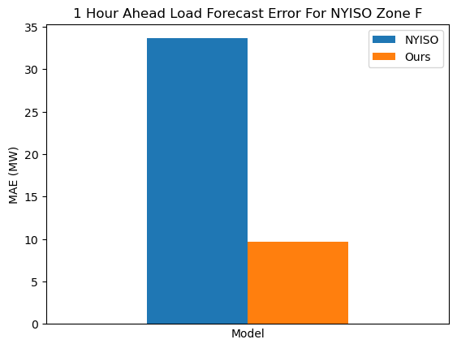

# An Exploration of HHHR Data for Short Term Load Forecast

This is a research project to explore how [HRRR](https://rapidrefresh.noaa.gov/hrrr/) weather data can improve the short term electric load forecast. We use [NYISO](https://www.nyiso.com/real-time-dashboard) load data at Zone F to compare our model based on HRRR data, and NYISO model performance.

The findings include:
- 1 hour ahead forecast, for NYISO Zone F, in 2021, was tested.

- The improvement seems to be from the time series contribution from the 1-D convolution. 

- The weather data does not appear to have abundant spatial informaiton. A PCA analysis for the 2-m temperature shows the first component explains over 99.7% of the total variance. 
- In addition to the temperature, humidity and wind speed, other parameters, like boundary layer height, radiation can improve the accuracy slightly.

- The prior hour weather reduces error, and the coefficients are estimated within the model.

Some details on how the data are retrieved and how the model are trained are explained in the [readme_technical.md](readme_techincal.md) file. 
